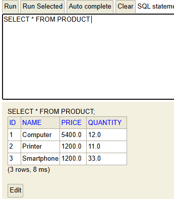
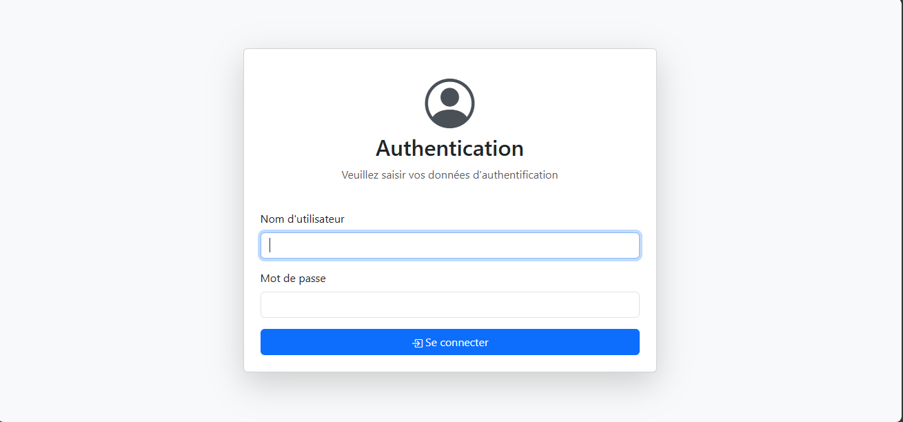
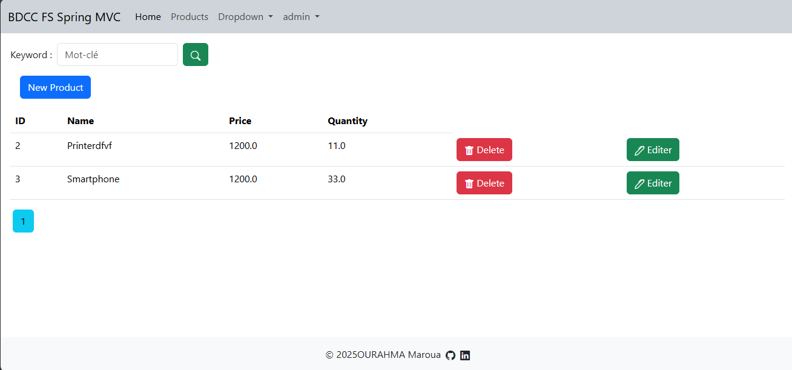
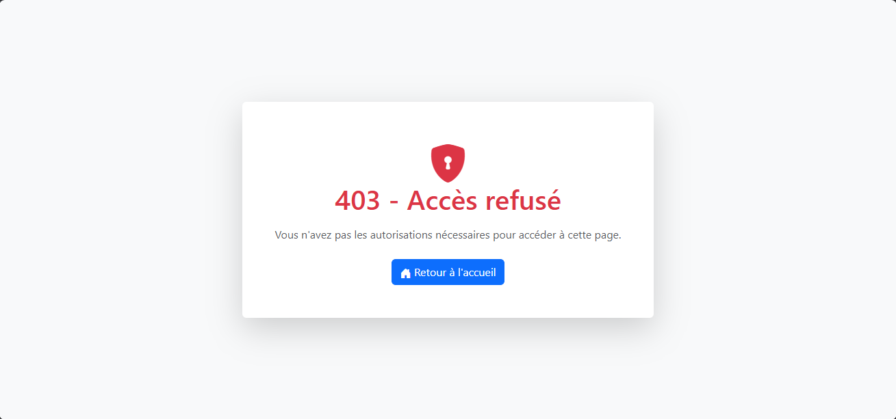
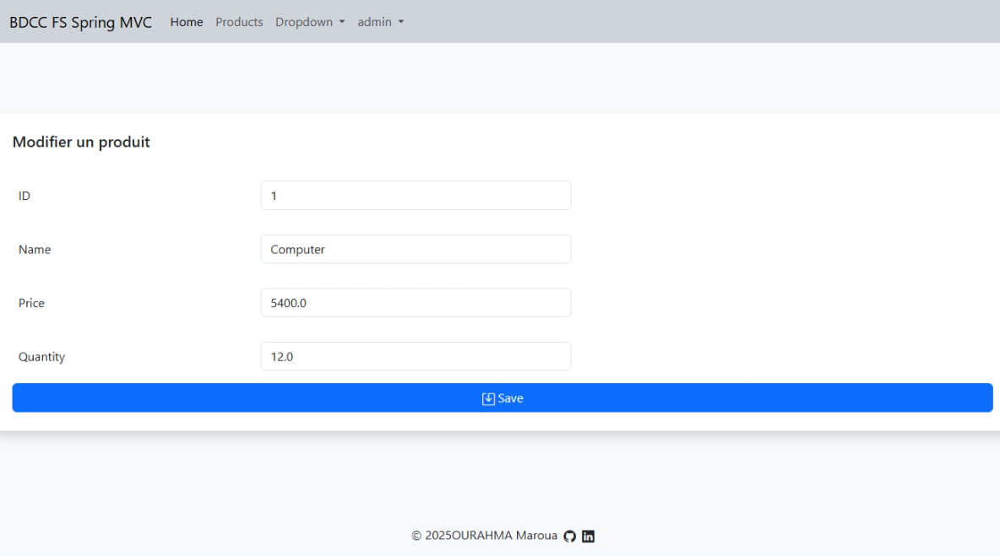
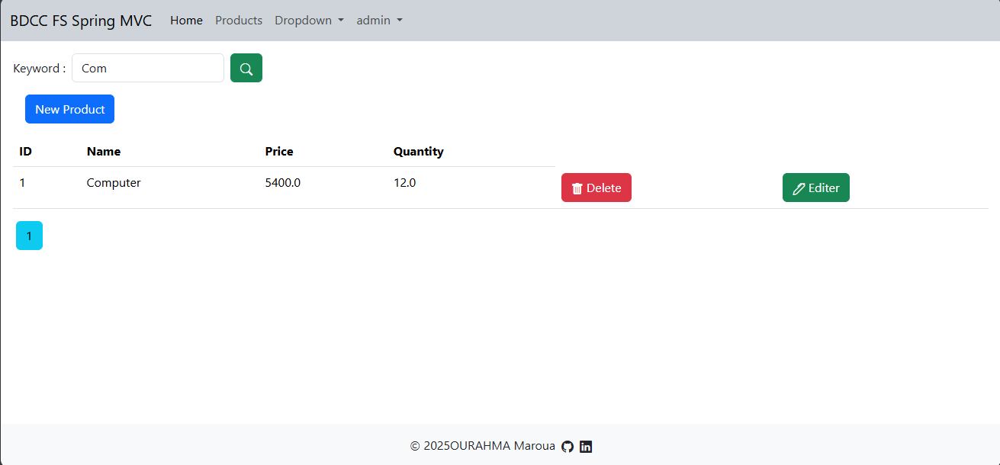
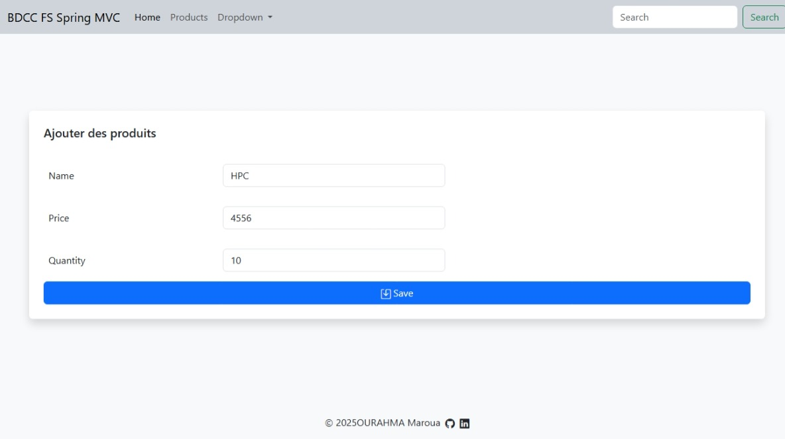
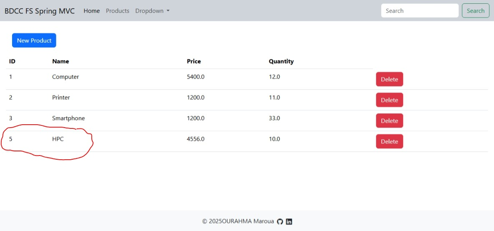

# BDCC SPring MVC
# Spring MVC

* Nom : OURAHMA.
* Prènom : Maroua.
* Filière : Master en Intelligence artificielle et sciences de données
* Universitè : Facultès des sciences Universitè Moulay Ismail Meknès.

## **1. Introduction**

Ce projet a pour objectif de développer une application web Java EE moderne en s'appuyant sur les frameworks `Spring Boot`, `Spring Data JPA`, `Hibernate`, `Thymeleaf` et `Spring Security`. 

Il s'agit d'une solution complète de gestion de produits permettant l'affichage, l'ajout, la suppression, la mise à jour et la recherche de produits dans une base de données relationnelle.
L'application repose sur une architecture en couches bien structurée et utilise Bootstrap pour garantir une interface utilisateur responsive et agréable.

---
## **2. Enoncé**

Le but de ce projet est de créer une application web de gestion de produits en Java EE avec Spring Boot.
Voici les étapes et fonctionnalités attendues :

1. Initialisation du projet avec les dépendances suivantes :

    * `Spring Web`
    * `Spring Data JPA`
    * `H2 & MySQL`
    * `Thymeleaf`
    * `Lombok`
    * `Spring Security`
    * `Spring Validation`

2. Création de l’entité JPA Product représentant un produit à gérer.

3. Mise en place de la couche DAO avec l’interface ProductRepository basée sur Spring Data JPA.

4. Test de la couche DAO avec des données persistantes.

5. Désactivation temporaire de la protection par défaut de Spring Security pour faciliter les tests initiaux.

6. Création du contrôleur Spring MVC et des vues Thymeleaf permettant :

    * L’affichage de la liste des produits
    * La suppression d’un produit
    * L’ajout d’un produit avec formulaire et validation
    * L’utilisation d’un layout réutilisable basé sur Thymeleaf Layout Dialect et Bootstrap

7. Sécurisation de l'application avec Spring Security, incluant la gestion de l’authentification et l’affichage conditionnel selon les rôles.

8. Ajout de fonctionnalités supplémentaires telles que :

    * La recherche de produits par mot-clé
    * L’édition et la mise à jour des produits
    * Toute autre fonctionnalité pertinente pour améliorer l’expérience utilisateur

---
## **3. Implémentation**
3.1. **L'architecture MVC de projet**
Ce projet adopte l’architecture MVC (Model - View - Controller) typique des applications Spring Boot. Il est structuré en plusieurs couches bien séparées pour assurer une meilleure maintenabilité et évolutivité.

* **Entities** : contient les classes métier représentées en tant qu’entités JPA.
* **sec** : gère l’authentification et l’autorisation via Spring Security.
* **repository :** contient les interfaces qui assurent la communication avec la base de données via Spring Data JPA.
* **Web** : (Controllers + Vues)
    * Contrôleurs (Controllers) : Reçoivent les requêtes HTTP, appellent les services et retournent les vues.
    * Vues (Thymeleaf) : Pages HTML utilisant le moteur de template Thymeleaf. Intégration de Thymeleaf Layout Dialect pour utiliser un layout principal (layout.html).


3.2. **L'entité Product JPA**

La classe Product est une entité `JPA` représentant un produit dans la base de données. Elle est mappée à une table relationnelle et permet à Spring Data JPA de gérer automatiquement les opérations CRUD sur les enregistrements produits.

```java
package net.ourahma.bdccfsspringmvc.entities;

import jakarta.persistence.Entity;
import jakarta.persistence.GeneratedValue;
import jakarta.persistence.GenerationType;
import jakarta.persistence.Id;
import jakarta.validation.constraints.Min;
import jakarta.validation.constraints.NotEmpty;
import jakarta.validation.constraints.Size;
import lombok.*;

@Entity @AllArgsConstructor @NoArgsConstructor @Getter @Setter
@ToString @Builder
public class Product {
    @Id @GeneratedValue(strategy = GenerationType.IDENTITY)
    private Long id;
    @NotEmpty
    @Size(min = 3, max=50)
    private String name;
    @Min(0)
    private double price;
    @Min(1)
    private double quantity;
}
```

**Les annotations JPA**
* `@Entity` Déclare la classe comme une entité JPA, ce qui signifie qu’elle sera mappée à une table dans la base de données.
* `@Id` :Indique que le champ id est la clé primaire de l’entité.

* `@GeneratedValue(strategy = GenerationType.IDENTITY)` Spécifie que la valeur de la clé primaire sera générée automatiquement par la base (auto-incrémentée).

**Annotations de Validation**
* `@NotEmpty` Utilisée pour s’assurer que le champ name n’est pas vide (non nul et non vide).
* `@Size(min = 3, max = 50)` Définit une contrainte sur la taille du champ name (entre 3 et 50 caractères).
* `@Min(0)` : Appliquée à price, elle garantit que la valeur est supérieure ou égale à 0.
* `@Min(1)` : Pour quantity, elle impose une valeur minimale de 1.

**Annotations Lombok**
* `@AllArgsConstructor` : Génère un constructeur avec tous les arguments.

* `@NoArgsConstructor` : Génère un constructeur vide (sans arguments).
* `@Getter / @Setter` :Génèrent automatiquement les accesseurs (getters) et mutateurs (setters) pour tous les champs.
* `@ToString` :Génère une méthode toString() utile pour l’affichage des objets.
* `@Builder` Permet de créer des objets Product à l’aide du design pattern Builder, facilitant une construction fluide et lisible.

3.3 **La couche DAO**

`ProductRepository` est une interface qui représente la couche `DAO` (Data Access Object) de l’application. Elle permet d’effectuer automatiquement toutes les opérations de base sur la base de données (`CRUD`) pour l’entité Product, sans avoir à écrire la moindre requête SQL. Cette interface hérite de `JpaRepository` de `Spring Data JPA`, ce qui offre une abstraction puissante et réutilisable pour manipuler les données.


```java
package net.ourahma.bdccfsspringmvc.repository;

import net.ourahma.bdccfsspringmvc.entities.Product;
import org.springframework.data.jpa.repository.JpaRepository;

public interface ProductRepository extends JpaRepository<Product, Long> {
}
```
* `JpaRepository<Product, Long>` : hérite de l’interface JpaRepository fournie par Spring Data.

    * Le premier paramètre (Product) est l'entité à gérer.
    * Le second paramètre (Long) est le type de la clé primaire de l'entité.

* En étendant `JpaRepository`, l’interface bénéficie automatiquement de toutes les méthodes standard : `findAll()`, `findById()`, `save()`, `deleteById()`, etc.

* Aucune implémentation manuelle n’est nécessaire : Spring Boot génère automatiquement le bean correspondant au démarrage de l’application.

3.4. **Tester la couche DAO**

Dans la classe `BdccFsSpringMvcApplication` éxécuté à chaque démarrage un ensemble d'objets `Product` sont crées et stockés dans la base de données `h2` en outre la sécurité par défaut de `Spring boot` est désactivée et configurée par la suite.

```java
package net.ourahma.bdccfsspringmvc;

import net.ourahma.bdccfsspringmvc.entities.Product;
import net.ourahma.bdccfsspringmvc.repository.ProductRepository;
import org.springframework.boot.CommandLineRunner;
import org.springframework.boot.SpringApplication;
import org.springframework.boot.autoconfigure.SpringBootApplication;
import org.springframework.boot.autoconfigure.security.servlet.SecurityAutoConfiguration;
import org.springframework.context.annotation.Bean;

//@SpringBootApplication(exclude = {SecurityAutoConfiguration.class})
@SpringBootApplication
public class BdccFsSpringMvcApplication {

    public static void main(String[] args) {
        SpringApplication.run(BdccFsSpringMvcApplication.class, args);
    }

    // premier test pour exécuter des traitements au démarrage
    @Bean
    CommandLineRunner start(ProductRepository productrepository) {
        return args -> {
            //ajouter des produite
            productrepository.save(Product.builder()
                    .name("Computer")
                    .price(5400)
                    .quantity(12)
                    .build());

            productrepository.save(Product.builder()
                    .name("Printer")
                    .price(1200)
                    .quantity(11)
                    .build());

            productrepository.save(Product.builder()
                    .name("Smartphone")
                    .price(1200)
                    .quantity(33)
                    .build());

            productrepository.findAll().forEach(System.out::println);
        };
    }
}
```
**Le lencement de test**


**Les produits s'affichent dans la base de données**



3.5. Création de controller `ProductController`:

ProductController gère les différentes routes (URL) de l'application web en utilisant Spring MVC, et applique des règles de sécurité via Spring Security. Elle permet l'affichage, la création, la suppression, et la sécurisation des accès aux produits via des vues Thymeleaf.

```java
package net.ourahma.bdccfsspringmvc.web;

import jakarta.servlet.http.HttpSession;
import jakarta.validation.Valid;
import lombok.AllArgsConstructor;
import net.ourahma.bdccfsspringmvc.entities.Product;
import net.ourahma.bdccfsspringmvc.repository.ProductRepository;
import org.springframework.security.access.prepost.PreAuthorize;
import org.springframework.stereotype.Controller;
import org.springframework.ui.Model;
import org.springframework.validation.BindingResult;
import org.springframework.web.bind.annotation.DeleteMapping;
import org.springframework.web.bind.annotation.GetMapping;
import org.springframework.web.bind.annotation.PostMapping;
import org.springframework.web.bind.annotation.RequestParam;

import java.util.List;

@Controller @AllArgsConstructor
public class ProductController {
    private ProductRepository productRepository;


    @GetMapping("/user/index")
    @PreAuthorize("hasRole('USER')")
    public String index(Model model){
        List<Product> products = productRepository.findAll();
        model.addAttribute("productsList", products);
        return "products";
    }
    // la page par défaut
    @GetMapping("/")
    public String home(){
        return "redirect:/user/index";
    }

    // la page d'ajout des nouveaus produite
    @GetMapping("/admin/newProduct")
    @PreAuthorize("hasRole('ADMIN')")
    public String newProduct(Model model){
        model.addAttribute("product", new Product());
        return "new-product";
    }

    // sauvegarder un produit
    /**
     * @Valid va vérifier la validation des données
     * Les résultat sont stocké dans un objet BindingResult
     * lorsque on saisit les données elles sont stockées automatiquement dans le modèle donc il faut le déclarer
     * ***/
    @PostMapping("/admin/saveProduct")
    @PreAuthorize("hasRole('ADMIN')")
    public String saveProduct(@Valid Product product, BindingResult bindingResult, Model model){
        System.out.println("save product"+product);
        if(bindingResult.hasErrors()){
            return "new-product";
        }else{
            productRepository.save(product);
            return "redirect:/admin/newProduct";
        }

    }
    // supprimer des produits
    @PostMapping("/admin/delete")
    @PreAuthorize("hasRole('ADMIN')")
    public String delete(@RequestParam(name="id") Long id){
        productRepository.deleteById(id);
        return "redirect:/user/index";
    }

    // la page d'erreur
    @GetMapping("/notAuthorized")
    public String notAuthorized(){
        return "notAuthorized";
    }
    // la page login personnélisée
    @GetMapping("/login")
    public String login(){
        return "login";
    }

    // la fontionnalité logout
    @GetMapping("/logout")
    public String logout(HttpSession httpSession){
        httpSession.invalidate();
        return "redirect:login";
    }
}

```

**Les annotations utilisées**

* `@Controller` : indique que cette classe et une controller `Spring MVC` responsable de gérer les requêtes HTTP et retourner des vues.
* `@PreAuthorize("hasRole('...')")` : Restreint l'accès à certaines méthodes selon le rôle de l'utilisateur (USER ou ADMIN).
* `@Valid` :Déclenche la validation des objets selon les contraintes définies dans l'entité Product.

**Les méthodes disponibles**

* `index` : 
    * Affiche la liste de tous les produits.
    * Accessible uniquement aux utilisateurs avec le rôle USER.
    * Les produits sont injectés dans le modèle pour affichage dans la vue products.html
* `home` :
    * Redirige vers la page /user/index.
    * Sert de page d'accueil par défaut de l’application.
* `newProduct(Model model)` :
    * Affiche le formulaire vide pour créer un nouveau produit.
    * Accessible uniquement aux utilisateurs ADMIN.

* `saveProduct(@Valid Product product, BindingResult bindingResult, Model model)` : 
    * Enregistre un nouveau produit en base de données après validation.
    * Si des erreurs sont présentes (bindingResult.hasErrors()), la page de formulaire est rechargée.
    * Sinon, le produit est sauvegardé et redirige vers le formulaire pour ajouter un autre produit.

* `delete(@RequestParam("id") Long id)`:
    * Supprime un produit identifié par son id.
    * Réservé aux utilisateurs `ADMIN`.
    * Redirige vers la page d'affichage des produits après suppression.
* `notAuthorized()` : Affiche une page personnalisée pour les accès non autorisés.
* `login()` : Affiche la page de connexion personnalisée.
* `logout(HttpSession session)` : 
    * Invalide la session actuelle pour effectuer la déconnexion manuelle.
    * Redirige vers la page de login après le logout.

3.6. Configuration de la sécurité Spring :

La classe `SecurityConfig` est responsable de la configuration de la sécurité de l'application Web en utilisant **Spring Security**. Elle permet de définir les utilisateurs, leurs rôles, les stratégies d'authentification, ainsi que les restrictions d'accès aux différentes routes de l'application. Elle suit une approche **Java Config** avec des beans définis manuellement.
```java
package net.ourahma.bdccfsspringmvc.sec;

import org.springframework.context.annotation.Bean;
import org.springframework.context.annotation.Configuration;
import org.springframework.security.config.Customizer;
import org.springframework.security.config.annotation.authentication.configuration.EnableGlobalAuthentication;
import org.springframework.security.config.annotation.method.configuration.EnableGlobalMethodSecurity;
import org.springframework.security.config.annotation.web.builders.HttpSecurity;
import org.springframework.security.config.annotation.web.configuration.EnableWebSecurity;
import org.springframework.security.core.userdetails.User;
import org.springframework.security.core.userdetails.UserDetails;
import org.springframework.security.core.userdetails.UserDetailsService;
import org.springframework.security.core.userdetails.UsernameNotFoundException;
import org.springframework.security.crypto.bcrypt.BCryptPasswordEncoder;
import org.springframework.security.crypto.password.PasswordEncoder;
import org.springframework.security.provisioning.InMemoryUserDetailsManager;
import org.springframework.security.web.SecurityFilterChain;

@Configuration //pour indiquer que c une classe de configuraton
@EnableWebSecurity // pour activer la sécurité web
@EnableGlobalMethodSecurity(prePostEnabled = true)
public class SecurityConfig {

    @Bean
    PasswordEncoder passwordEncoder() {
        return new BCryptPasswordEncoder();
    }
    @Bean // indiquer qu'ils sont les utilisateurs qui ont droit à accéder l'apk
    public InMemoryUserDetailsManager inMemoryUserDetailsManager() {
        PasswordEncoder encoder = passwordEncoder();
        return new InMemoryUserDetailsManager(
                User.withUsername("user1").password(encoder.encode("1234")).roles("USER").build(),
                User.withUsername("user2").password(encoder.encode("1234")).roles("USER").build(),
                User.withUsername("admin").password(encoder.encode("1234")).roles("USER","ADMIN").build()
        );
    }

    //@Bean
    public UserDetailsService userDetailsService(){
        return new UserDetailsService() {
            @Override
            public UserDetails loadUserByUsername(String username) throws UsernameNotFoundException {
                return null;
            }
        };
    }
    @Bean
    public SecurityFilterChain securityFilterChain(HttpSecurity http) throws Exception {
        // spécifier la stratégie de sécurité
        /**
         * Customizer.withDefaults(): si un utilisateur n'est oas authentifié utilise ton propre form d'authentification.
         * authorizeHttpRequests(ar -> ar.anyRequest().authenticated()): impliquer que tous les requêtes sont authentifiées
         * ar.requestMatchers("/index/**").hasRole("USER") : toutes les requêtes avec ce url doivent avoir role user
         * permitALL : ne nécessite pas d'authentification
         * **/
        return http
                .formLogin(fl ->fl.loginPage("/login").permitAll())
                //.csrf(csrf -> csrf.disable()) // à désactiver seulement dans authentification stateless
                .csrf(Customizer.withDefaults())
                //.authorizeHttpRequests(ar -> ar.requestMatchers("/user/**").hasRole("USER"))
                //.authorizeHttpRequests(ar -> ar.requestMatchers("/admin/**").hasRole("ADMIN"))
                .authorizeHttpRequests(ar -> ar.requestMatchers("/public/*","/webjars/**").permitAll())
                .authorizeHttpRequests(ar -> ar.anyRequest().authenticated())
                .exceptionHandling( eh -> eh.accessDeniedPage("/notAuthorized"))
                .build(

        );
    }
}

```

**Annotation**

* `@Configuration` : Indique que cette classe définit une configuration Spring.
* `@EnableWebSecurity` : Active la sécurité Web de Spring Security.
* `@EnableGlobalMethodSecurity(prePostEnabled = true)` : Permet d'utiliser `@PreAuthorize` pour contrôler l'accès aux méthodes.

**Les Beans et leur rôle**

1. `passwordEncoder()`
    * Crée un **encodeur de mots de passe** utilisant l'algorithme **BCrypt**, assurant un hachage sécurisé des mots de passe.

2. `inMemoryUserDetailsManager()`
    * Crée un gestionnaire d'utilisateurs en mémoire avec trois utilisateurs prédéfinis.

3. `userDetailsService()`
    * Méthode définie pour éventuellement charger un utilisateur via une source externe (non implémentée ici).

4. `securityFilterChain(HttpSecurity http)`

    * Configure la chaîne de filtres de sécurité :

    * `formLogin(...)` : Spécifie une page de login personnalisée (`/login`).
    * `csrf(...)` : Active la protection CSRF (désactivable si nécessaire).
    * `authorizeHttpRequests(...)` :

        * Autorise sans authentification les ressources publiques : `/public/*`, `/webjars/**`
        * Exige une authentification pour toutes les autres routes.
    * `exceptionHandling(...)` : Redirige vers `/notAuthorized` en cas d'accès interdit.

3.7.Ajout d'adutres fontionnalités:

**Ajout de la pagination et la recherche :**

Cette méthode permet de cherche un `Product` avec Pagable qui permet de retourner des pages pour les afficher dans `products.html`.
```java
public interface ProductRepository extends JpaRepository<Product, Long> {

    Page<Product> findByNameContains(String keyword, Pageable pageable);
}
```
**Template `products.html`**

Dans cette page on a jouté le formulaire de la recherche avec la liste de pagination.

```html
<div class="p-3" layout:fragment="content1">
    <form method="get" class="d-flex align-items-center gap-2" th:action="@{/user/index}">
        <label for="search" class="form-label mb-0">Keyword : </label>
        <input type="text" class="form-control" id="search"
               name="keyword" th:value="${keyword}" placeholder="Mot-clé" style="width: 200px;">
        <button type="submit" class="btn btn-success"><i class="bi bi-search"></i></button>
    </form>
    <div class="p-3" sec:authorize="hasRole('ADMIN')">
        <a class="btn btn-primary" th:href="@{/admin/newProduct}">New Product</a>
    </div>
    <table class="table ">
        <thead class="table-header">
        <tr> <th>ID</th><th>Name</th><th>Price</th><th>Quantity</th></tr>
        </thead>
        <tbody >
        <tr th:each="p:${productsList}">
            <td th:text="${p.id}"></td>
            <td th:text="${p.name}"></td>
            <td th:text="${p.price}"></td>
            <td th:text="${p.quantity}"></td>
            <td sec:authorize="hasRole('ADMIN')">
                <form th:action="@{/admin/delete(id=${p.id})}" method="post">
                    <button type="submit" class="btn btn-danger"
                       onclick="return confirm('Etes vous sûre de vouloir supprimer ? ')">
                        <i class="bi bi-trash-fill"></i>
                        Delete
                       </button>
                </form>

            </td>
        </tr>
        </tbody>
    </table>
    <ul class="nav nav-pills">
        <li th:each="value, item:${pages}">
            <a th:href="@{/user/index(page=${item.index}, keyword=${keyword})}"
               th:class="${currentPage==item.index?'btn btn-info ms-1':'btn btn-outline-info ms-1'}"
               th:text="${1+item.index}"></a>
        </li>
        </ul>
</div>
```
**Le controlleur `ProductControlleru.java`**

Cette classe a éte modifié de tel sorte rececoir les paramètres dans les requêtes de keyword, page et size et appliquer la pagination et la recherche.

```java
package net.ourahma.bdccfsspringmvc.web;

import jakarta.servlet.http.HttpSession;
import jakarta.validation.Valid;
import lombok.AllArgsConstructor;
import net.ourahma.bdccfsspringmvc.entities.Product;
import net.ourahma.bdccfsspringmvc.repository.ProductRepository;
import org.springframework.data.domain.Page;
import org.springframework.data.domain.PageRequest;
import org.springframework.security.access.prepost.PreAuthorize;
import org.springframework.stereotype.Controller;
import org.springframework.ui.Model;
import org.springframework.validation.BindingResult;
import org.springframework.web.bind.annotation.DeleteMapping;
import org.springframework.web.bind.annotation.GetMapping;
import org.springframework.web.bind.annotation.PostMapping;
import org.springframework.web.bind.annotation.RequestParam;

import java.util.List;

@Controller @AllArgsConstructor
public class ProductController {
    private ProductRepository productRepository;


    @GetMapping("/user/index")
    @PreAuthorize("hasRole('USER')")
    public String index(Model model,
                        @RequestParam(name="page",defaultValue = "0")int page,
                        @RequestParam(name="size",defaultValue = "5")int size,
                        @RequestParam(name="keyword",defaultValue = "")String keyword){
        Page<Product> pageProduct = productRepository.findByNameContains(keyword, PageRequest.of(page,size));

        //List<Product> products = productRepository.findAll();
        model.addAttribute("productsList", pageProduct.getContent());
        model.addAttribute("pages",new int[pageProduct.getTotalPages()]);
        model.addAttribute("currentPage",page);
        model.addAttribute("keyword",keyword);
        return "products";
    }
    // la page par défaut
    @GetMapping("/")
    public String home(@RequestParam(name="page",defaultValue = "0")int page,
                       @RequestParam(name="size",defaultValue = "5")int size,
                       @RequestParam(name="keyword",defaultValue = "")String keyword){
        return "redirect:/user/index?page="+page+"&keyword="+keyword;
    }

    // la page d'ajout des nouveaus produite
    @GetMapping("/admin/newProduct")
    @PreAuthorize("hasRole('ADMIN')")
    public String newProduct(Model model){
        model.addAttribute("product", new Product());
        return "new-product";
    }

    // sauvegarder un produit
    /**
     * @Valid va vérifier la validation des données
     * Les résultat sont stocké dans un objet BindingResult
     * lorsque on saisit les données elles sont stockées automatiquement dans le modèle donc il faut le déclarer
     * ***/
    @PostMapping("/admin/saveProduct")
    @PreAuthorize("hasRole('ADMIN')")
    public String saveProduct(@Valid Product product, BindingResult bindingResult, Model model,
                              @RequestParam(name = "keyword", defaultValue = "") String keyword,
                              @RequestParam(name = "page", defaultValue = "0") int page){
        System.out.println("save product"+product);
        if(bindingResult.hasErrors()){
            return "new-product";
        }else{
            productRepository.save(product);
            model.addAttribute("keyword", keyword);
            model.addAttribute("page", page);
            return "redirect:/admin/newProduct";
        }

    }
    // supprimer des produits
    @PostMapping("/admin/delete")
    @PreAuthorize("hasRole('ADMIN')")
    public String delete(@RequestParam(name="id") Long id,
                         @RequestParam(name="page",defaultValue = "0")int page,
                         @RequestParam(name="size",defaultValue = "5")int size,
                         @RequestParam(name="keyword",defaultValue = "")String keyword){
        productRepository.deleteById(id);
        return "redirect:/user/index?page=" +page+ "&keyword="+keyword;
    }

    // la page d'erreur
    @GetMapping("/notAuthorized")
    public String notAuthorized(){
        return "notAuthorized";
    }
    // la page login personnélisée
    @GetMapping("/login")
    public String login(){
        return "login";
    }

    // la fontionnalité logout
    @GetMapping("/logout")
    public String logout(HttpSession httpSession){
        httpSession.invalidate();
        return "redirect:login";
    }

    //retoutner la page de modification
    @GetMapping("/admin/editProduct")
    @PreAuthorize("hasRole('ADMIN')")
    public String editProduct(Model model, Long id, String keyword, int page){
        Product product = productRepository.findById(id).orElse(null);
        if(product == null)throw new RuntimeException("Product introuvable");
        model.addAttribute("product", product);
        model.addAttribute("keyword", keyword);
        model.addAttribute("page", page);
        return "editProduct";
    }

}

```

* `index(Model model...)` : cette méthode a été modifié pour aussi traiter les recherches et retourné des pages.
* `String editProduct(Model model...)` : cette méthode permet de récupérer le product et le retourner à un formulaire.

---
## **4. Résultats**
**Authentification**


**La gestion des rôles**

Seul l'admin peut visualiser cette version de l'application où des fontionnalités comme Delete et Update dont visible en bouton ce pourtant elles sont sécurisé en utilisant `@PreAuthorize("hasRole('ADMIN')")`



**La page `notAuthorized.html` personnalisé**


**Modifier un produit**


**La fontionnalité rechercher**


**La fontionnalité d'ajout**


* Résultat :

---
## **5. Conclusion**

Cette application web sécurisée, développée avec JEE, Spring Boot et Spring Security, propose une architecture robuste pour la gestion des utilisateurs et des rôles. Elle intègre des fonctionnalités d’authentification et d’autorisation avancées, garantissant la protection des ressources sensibles. L’approche MVC, combinée à une gestion efficace des routes et des vues, offre une expérience utilisateur fluide. Ce projet démontre la puissance de l’écosystème Spring dans le développement d’applications d’entreprise modernes et sécurisées.

---
## **6. Auteur**

- **Nom:**  OURAHMA
- **Prénom:** Maroua
- **Courriel:** [Email](mailto:marouaourahma@gmail.com)
- **LinkedIn:** [Linkedin](www.linkedin.com/in/maroua-ourahma)